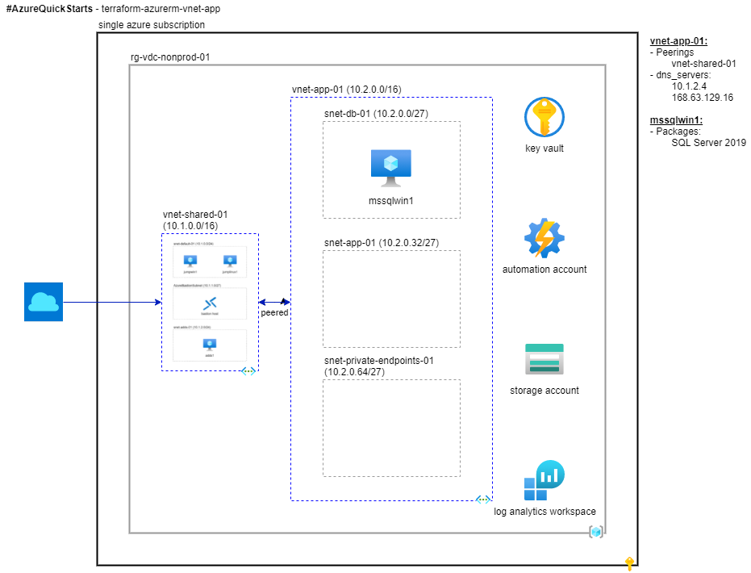

# \#AzureQuickStarts - terraform-azurerm-vnet-app

## Overview

This quick start implements a virtual network for applications including:

* A virtual network for hosting application infrastructure and services
  * [Virtual network peering](https://docs.microsoft.com/en-us/azure/virtual-network/virtual-network-peering-overview) is enabled with the shared services virtual network in [terraform-azurerm-vnet-shared](../terraform-azurerm-vnet-shared).
* An [IaaS](https://azure.microsoft.com/en-us/overview/what-is-iaas/) database server [virtual machine](https://docs.microsoft.com/en-us/azure/azure-glossary-cloud-terminology#vm) based on the [SQL Server virtual machines in Azure](https://docs.microsoft.com/en-us/azure/azure-sql/virtual-machines/windows/sql-server-on-azure-vm-iaas-what-is-overview#payasyougo) offering.
* A [PaaS](https://azure.microsoft.com/en-us/overview/what-is-paas/) database hosted in [Azure SQL Database](https://docs.microsoft.com/en-us/azure/azure-sql/database/sql-database-paas-overview) with a private endpoint implemented using [PrivateLink](https://docs.microsoft.com/en-us/azure/azure-sql/database/private-endpoint-overview).

Activity | Estimated time required
--- | ---
Pre-configuration | ~5 minutes
Provisioning | ~15 minutes
Smoke testing | ~ 5 minutes

## Before you start

The following quick starts must be deployed first before starting:

* [terraform-azurerm-vnet-shared](../terraform-azurerm-vnet-shared)

## Getting started

This section describes how to provision this quick start using default settings.

* Change the working directory to `~/azurequickstarts/terraform-azurerm-vnet-app`.
* Run `./bootstrap.sh` using the default settings or your own custom settings.
* Run `terraform init` and note the version of the *azurerm* provider installed.
* Run `terraform validate` to check the syntax of the configuration.
* Run `terraform plan` and review the plan output.
* Run `terraform apply` to apply the configuration. Monitor the output until you see the message *Apply complete!*.
* Run `terraform state list` to list the resources managed in the configuration.

## Smoke testing

* Explore your newly provisioned resources in the Azure portal.
  * Navigate to *portal.azure.com* > *Automation Accounts* > [My Automation Account] > *Configuration Management* > *State configuration (DSC)*.
    * Refresh the data on the *Nodes* tab and verify that all nodes are compliant.
    * Review the data in the *Configurations* and *Compiled configurations* tabs as well.
* Connect to the Windows Server Jumpbox VM.
  * Navigate to *portal.azure.com* > *Virtual machines* > *jumpwin1*
    * Click *Connect*, select the *Bastion* tab, then click *Use Bastion*
    * For *username* enter the UPN of the domain admin, which by default is *bootstrapadmin@mytestlab.local*.
    * For *password* use the value of the *adminpassword* secret in key vault.
    * Click *Connect*
  * Test DNS queries for SQL Server and Azure SQL Database private endpoint
    * Using PowerShell, run the command `Resolve-DnsName mssqlwin1`.
    * Verify the IPAddress returned is within the subnet IP address prefix for *azurerm_subnet.vnet_app_01_subnets["database"]*, e.g. *10.2.0.4*.
      * Note: This DNS query is resolved by the DNS Server running on *azurerm_windows_virtual_machine.vm_adds*.
  * Test DNS queries for Azure SQL database private endpoint
    * Navigate to *portal.azure.com* > *SQL Servers* > *mssql-xxxxxxxxxxxxxxxx* > *Properties* > *Server name* and and copy the the FQDN, e.g. *mssql&#x2011;xxxxxxxxxxxxxxxx.database.windows.net*.
    * Using PowerShell, run the command `Resolve-DnsName mssql-xxxxxxxxxxxxxxxx.database.windows.net`.
    * Verify the *IP4Address* returned is within the subnet IP address prefix for *azurerm_subnet.vnet_app_01_subnets["PrivateLink"]*, e.g. `10.2.2.4`.
      * Note: This DNS query is resolved using *azurerm_private_dns_zone_virtual_network_link.database_windows_net_to_vnet_shared_01*.
  * Test SQL Server Connectivity with SQL Server Management Studio (SSMS)
    * Navigate to *Start* > *Microsoft SQL Server Tools 18* > *Microsoft SQL Server Management Studio 18*
    * Connect to the default instance of SQL Server installed on the database server virtual machine using the following default values:
      * Server name: *mssqlwin1*
      * Authentication: *Windows Authentication* (this will default to *MYTESTLAB\bootstrapadmin*)
      * Create a new database named *testdb*.
        * Verify the data files were stored on the *M:* drive
        * Verify the log file were stored on the *L:* drive
    * Connect to the Azure SQL Database server using PrivateLink
      * Server name: *mssql&#x2011;xxxxxxxxxxxxxxxx.database.windows.net*
      * Authentication: *SQL Server Authentication*
      * Login: *bootstrapadmin*
      * Password: Use the value stored in the *adminpassword* key vault secret
    * Expand the *Databases* tab and verify you can see *testdb*
  * Optional: Deny public access to Azure SQL Database
    * Perform these steps in your client environment (not on an Azure VM).
    * Test DNS configuration
      * Verify that PrivateLink is not already configured on your internal network
        * Open a command prompt
        * Run `ipconfig /all`
        * Scan the results for *privatelink.database.windows.net* in *Connection-specific DNS Suffix Search List*.
          * If found, PrivateLink is already configured on your private network.
            * If you are directly connected to your private network, skip this portion of the smoke testing.
            * If you are connected to your private network using a VPN, disconnect from it and try again.
              * If the *privatelink.database.windows.net* DNS Suffix is no longer listed, you can continue.
      * Using PowerShell, run the command `Resolve-DnsName mssql-xxxxxxxxxxxxxxxx.database.windows.net` and make a note of the *IP4Address* returned.
      * Navigate to [lookip.net](https://www.lookip.net/ip) and lookup the *IP4Address* from the previous step. Examine the *Technical details* and verify that the ISP for the IP Address is *Microsoft Corporation* and the Company is *Microsoft Azure*.
    * Add Azure SQL Database firewall rule for client IP
      * From the Azure portal, navigate to *Home* > *SQL Servers* > *mssql&#x2011;xxxxxxxxxxxxxxxx* > *Security* > *Firewalls and virtual networks*
      * Confirm *Deny public network access* is set to *No*
      * Click *+ Add client IP*.
      * Verify a firewall rulle was added to match your client IP address
      * Click *Save*
    * Test connectivity to Azure SQL Database using public endpoint
      * Launch *Microsoft SQL Server Management Studio* (SSMS)
      * Connect to the Azure SQL Database server using public endpoint
        * Server name: *mssql&#x2011;xxxxxxxxxxxxxxxx.database.windows.net*
        * Authentication: *SQL Server Authentication*
        * Login: *bootstrapadmin*
        * Password: Use the value stored in the *adminpassword* key vault secret
      * Expand the *Databases* tab and verify you can see *testdb*
      * Disconnect from Azure SQL Database
    * Deny public network access
      * In Visual Studio code, navigate to line 14 of [040-mssql.tf](./040-mssql.tf)
      * Change `public_network_access_enabled` from `true` to `false` and save the changes.
      * In the bash terminal, run `terraform plan` and verify a single change will be made to the *public_network_access_enabled* property of the *azurerm_mssql_server.mssql_server_01* resource.
      * Run `terraform apply` to apply the change.
    * Test connectivity to Azure SQL Database using public endpoint
      * Launch *Microsoft SQL Server Management Studio* (SSMS)
      * Connect to the Azure SQL Database server using public endpoint
        * Server name: *mssql&#x2011;xxxxxxxxxxxxxxxx.database.windows.net*
        * Authentication: *SQL Server Authentication*
        * Login: *bootstrapadmin*
        * Password: Use the value stored in the *adminpassword* key vault secret
      * Verify the connection was denied and examine the error message

## Documentation

This section provides additional information on various aspects of this quick start.

### Bootstrap script

This quick start uses the script [bootstrap.sh](./bootstrap.sh) to create a *terraform.tfvars* file for generating and applying Terraform plans. For simplified deployment, several runtime defaults are initialized using output variables stored the *terraform.tfstate* associated with the [terraform-azurerm-vnet-shared](../terraform-azurerm-vnet-shared) quick start, including:

Output variable | Sample value
--- | ---
aad_tenant_id | "00000000-0000-0000-0000-000000000000"
adds_domain_name | "mytestlab.local"
admin_password_secret | "adminpassword"
admin_username_secret | "adminuser"
arm_client_id | "00000000-0000-0000-0000-000000000000"
automation_account_name | "auto-9a633c2bba9351cc-01"
dns_server | "10.1.2.4"
key_vault_id | "/subscriptions/00000000-0000-0000-0000-000000000000/resourceGroups/rg-vdc-nonprod-01/providers/Microsoft.KeyVault/vaults/kv-XXXXXXXXXXXXXXX"
key_vault_name | "kv-XXXXXXXXXXXXXXX"
location | "eastus2"
resource_group_name | "rg-vdc-nonprod-01"
storage_account_name | "stXXXXXXXXXXXXXXX"
storage_container_name | "scripts"
subscription_id | "00000000-0000-0000-0000-000000000000"
tags | tomap( { "costcenter" = "10177772" "environment" = "dev" "project" = "#AzureQuickStarts" } )
vnet_shared_01_id | "/subscriptions/00000000-0000-0000-0000-000000000000/resourceGroups/rg-vdc-nonprod-01/providers/Microsoft.Network/virtualNetworks/vnet-shared-01"
vnet_shared_01_name | "vnet-shared-01"

The following PowerShell scripts are uploaded to the *scripts* container in the storage account using the access key stored in the key vault secret *storage_account_key* so they can be referenced by virtual machine extensions:

* [configure-mssql.ps1](./configure-mssql.ps1)
* [sql-startup.ps1](./sql-startup.ps1)

### Terraform Resources

This section lists the resources included in the Terraform configurations in this quick start.

#### Network resources

The configuration for these resources can be found in [020-network.tf](./020-network.tf).

Resource name (ARM) | Notes
--- | ---
azurerm_virtual_network.vnet_app_01 (vnet&#x2011;app&#x2011;01) | By default this virtual network is configured with an address space of `10.2.0.0/16` and is configured with DNS server addresses of 10.1.2.4 (the private ip for *azurerm_windows_virtual_machine.vm_adds*) and [168.63.129.16](https://docs.microsoft.com/en-us/azure/virtual-network/what-is-ip-address-168-63-129-16).
azurerm_subnet.vnet_app_01_subnets["database"] | The default address prefix for this subnet is `10.2.0.0/24` which includes the private ip address for *azurerm_windows_virtual_machine.vm_mssql_win*.
azurerm_subnet.vnet_app_01_subnets["application"] | The default address prefix for this subnet is `10.2.1.0/24` and is reserved for web and application servers.
azurerm_subnet.vnet_app_01_subnets["PrivateLink"] | The default address prefix for this subnet is `10.2.2.0/24`. *enforce_private_link_endpoint_network_policies* is enabled by default for use with [PrivateLink](https://docs.microsoft.com/en-us/azure/private-link/private-link-overview).
azurerm_virtual_network_peering.vnet_shared_01_to_vnet_app_01_peering | Establishes the [virtual network peering](https://docs.microsoft.com/en-us/azure/virtual-network/virtual-network-peering-overview) relationship from *azurerm_virtual_network.vnet_shared_01* to *azurerm_virtual_network.vnet_app_01*.
azurerm_virtual_network_peering.vnet_app_01_to_vnet_shared_01_peering | Establishes the [virtual network peering](https://docs.microsoft.com/en-us/azure/virtual-network/virtual-network-peering-overview) relationship from *azurerm_virtual_network.vnet_app_01* to *azurerm_virtual_network.vnet_shared_01*.

#### Database server virtual machine

The configuration for these resources can be found in [030-vm-mssql-win.tf](./030-vm-mssql-win.tf).

Resource name (ARM) | Notes
--- | ---
azurerm_windows_virtual_machine.vm_mssql_win (mssqlwin1) | By default, provisions a [Standard_B4ms](https://docs.microsoft.com/en-us/azure/virtual-machines/sizes-b-series-burstable) virtual machine for use as a database server. See below for more information.
azurerm_network_interface.vm_mssql_win_nic_01 (nic&#x2011;mssqlwin1&#x2011;1) | The configured subnet is *azurerm_subnet.vnet_app_01_subnets["database"]*.
azurerm_managed_disk.vm_mssql_win_data_disks["sqldata"] (disk&#x2011;mssqlwin1&#x2011;vol_sqldata_M) | By default, provisions an E10 [Standard SSD](https://docs.microsoft.com/en-us/azure/virtual-machines/disks-types#standard-ssd) [managed disk](https://docs.microsoft.com/en-us/azure/virtual-machines/managed-disks-overview) for storing SQL Server data files. Caching is set to *ReadOnly* by default.
azurerm_managed_disk.vm_mssql_win_data_disks["sqllog"] (disk&#x2011;mssqlwin1&#x2011;vol_sqllog_L) | By default, provisions an E4 [Standard SSD](https://docs.microsoft.com/en-us/azure/virtual-machines/disks-types#standard-ssd) [managed disk](https://docs.microsoft.com/en-us/azure/virtual-machines/managed-disks-overview) for storing SQL Server log files. Caching is set to *None* by default.
azurerm_virtual_machine_data_disk_attachment.vm_mssql_win_data_disk_attachments["sqldata"] | Attaches *azurerm_managed_disk.vm_mssql_win_data_disks["sqldata"]* to *azurerm_windows_virtual_machine.vm_mssql_win*.
azurerm_virtual_machine_data_disk_attachment.vm_mssql_win_data_disk_attachments["sqllog"] | Attaches *azurerm_managed_disk.vm_mssql_win_data_disks["sqllog"]* to *azurerm_windows_virtual_machine.vm_mssql_win*
azurerm_virtual_machine_extension.vm_mssql_win_postdeploy_script (vmext&#x2011;mssqlwin1&#x2011;postdeploy&#x2011;script) | Uploads [configure&#x2011;mssql.ps1](./configure-mssql.ps1) and [sql&#x2011;startup.ps1](./sql-startup.ps1) to *azurerm_windows_virtual_machine.vm_mssql_win* and executes [configure&#x2011;mssql.ps1](./configure-mssql.ps1) using the [Custom Script Extension for Windows](https://docs.microsoft.com/en-us/azure/virtual-machines/extensions/custom-script-windows).

* Guest OS: Windows Server 2019 Datacenter.
* By default the [patch orchestration mode](https://docs.microsoft.com/en-us/azure/virtual-machines/automatic-vm-guest-patching#patch-orchestration-modes) is set to `AutomaticByOS` rather than `AutomaticByPlatform`. This is intentional in case the user wishes to use the [SQL Server IaaS Agent extension](https://docs.microsoft.com/en-us/azure/azure-sql/virtual-machines/windows/sql-server-iaas-agent-extension-automate-management?tabs=azure-powershell) for patching both Windows Server and SQL Server.
* *admin_username* and *admin_password* are configured using key vault secrets *adminuser* and *adminpassword*.
* This resource is configured using a [provisioner](https://www.terraform.io/docs/language/resources/provisioners/syntax.html) that runs [aadsc-register-node.ps1](./aadsc-register-node.ps1) which registers the node with *azurerm_automation_account.automation_account_01* and applies the configuration [MssqlVmConfig.ps1](../terraform-azurerm-vnet-shared/MssqlVmConfig.ps1).
  * The default SQL Server instance is configured to support [mixed mode authentication](https://docs.microsoft.com/en-us/sql/relational-databases/security/choose-an-authentication-mode). This is to facilitate post-installation configuration of the default instance before the virtual machine is domain joined, and can be reconfigured to Windows authentication mode if required.
    * The builtin *sa* account is enabled and the password is configured using *adminpassword* key vault secret.
    * The *LoginMode* registry key is modified to support mixed mode authentication.
  * The virtual machine is domain joined.
  * The [Windows Firewall](https://docs.microsoft.com/en-us/windows/security/threat-protection/windows-firewall/windows-firewall-with-advanced-security#overview-of-windows-defender-firewall-with-advanced-security) is [Configured to Allow SQL Server Access](https://docs.microsoft.com/en-us/sql/sql-server/install/configure-the-windows-firewall-to-allow-sql-server-access). A new firewall rule is created that allows inbound traffic over port 1433.
  * A SQL Server Windows login is added for the domain administrator and added to the SQL Server builtin 'sysadmin' role.
* Post-deployment configuration is then implemented using a custom script extension that runs [configure-mssql.ps1](./configure-mssql.ps1) following guidelines established in [Checklist: Best practices for SQL Server on Azure VMs](https://docs.microsoft.com/en-us/azure/azure-sql/virtual-machines/windows/performance-guidelines-best-practices-checklist).
  * Data disk metadata is retrieved dynamically using the [Azure Instance Metadata Service (Windows)](https://docs.microsoft.com/en-us/azure/virtual-machines/windows/instance-metadata-service?tabs=windows) including:
    * Volume label and drive letter, e.g. *vol_sqldata_M*
    * Size
    * Lun
  * The metadata is then used to partition and format the raw data disks using the SQL Server recommended allocation unit size of 64K.
  * The *tempdb* database is moved from the OS disk to the Azure local temporary disk (D:) and special logic is implemented to avoid errors if the Azure virtual machine is stopped, deallocated and restarted on a different host. If this occurs the `D:\SQLTEMP` folder must be recreated with appropriate permissions in order to start the SQL Server.
    * The SQL Server is configured for manual startup
    * The scheduled task [sql-startup.ps1](./sql-startup.ps1) is created to recreate the `D:\SQLTEMP` folder then start SQL Server. The scheduled task is set to run automatically at startup using domain administrator credentials.
  * The data and log files for the *master*, *model* and *msdb* system databases are moved to the data and log disks respectively.
  * The SQL Server errorlog is moved to the data disk.
  * SQL Server `max server memory` is reconfigured to use 90% of available memory.
  
#### Azure SQL Database

The configuration for these resources can be found in [040-mssql.tf](./040-mssql.tf).

Resource name (ARM) | Notes
--- | ---
azurerm_mssql_server.mssql_server_01 (mssql-xxxxxxxxxxxxxxxx) | An [Azure SQL Database logical server](https://docs.microsoft.com/en-us/azure/azure-sql/database/logical-servers) for hosting databases.
azurerm_mssql_database.mssql_database_01 | A [single database](https://docs.microsoft.com/en-us/azure/azure-sql/database/single-database-overview) named *testdb* for testing connectivity.
azurerm_private_endpoint.mssql_server_01 | A private endpoint for connecting to [Azure SQL Database using PrivateLink](https://docs.microsoft.com/en-us/azure/azure-sql/database/private-endpoint-overview)
azurerm_private_dns_a_record.sql_server_01 | A DNS A record for resolving DNS queries to *azurerm_mssql_server.mssql_server_01* using PrivateLink. This resource has a dependency on the *azurerm_private_dns_zone.database_windows_net* resource.

## Next steps

Move on to the next quick start [terraform-azurerm-vwan](../terraform-azurerm-vwan).
