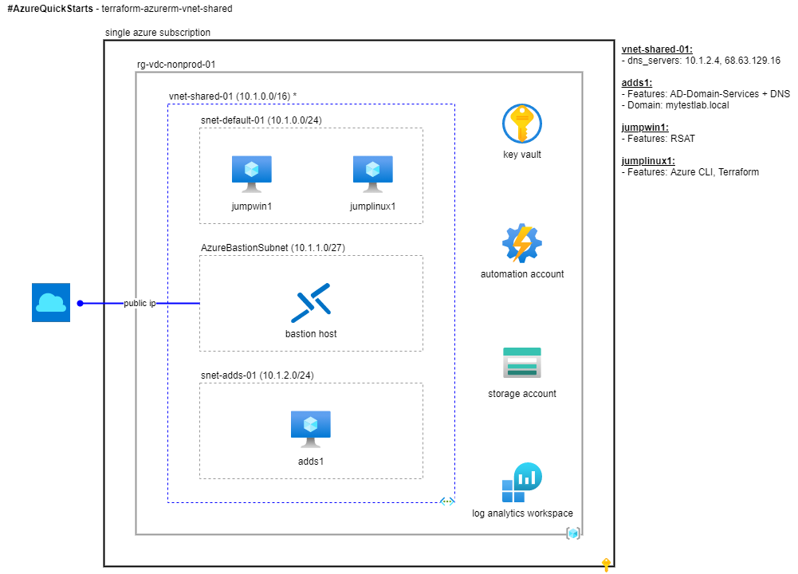

# #AzureQuickStarts - terraform-azurerm-vnet-shared  

## Overview

This quick start implements shared services used by all the quick starts including:

* A [resource group](https://docs.microsoft.com/en-us/azure/azure-glossary-cloud-terminology#resource-group) for provisioning Azure resources
* A [key vault](https://docs.microsoft.com/en-us/azure/key-vault/general/overview) for storing and retrieving shared secrets
* A [storage account](https://docs.microsoft.com/en-us/azure/azure-glossary-cloud-terminology#storage-account) for storing and retrieving data
* A [log analytics workspace](https://docs.microsoft.com/en-us/azure/azure-monitor/data-platform#collect-monitoring-data) for storing and querying metrics and logs
* An [automation account](https://docs.microsoft.com/en-us/azure/automation/automation-intro) for orchestration, configuration management and update management
* A shared services [virtual network](https://docs.microsoft.com/en-us/azure/azure-glossary-cloud-terminology#vnet) for hosting virtual machines used as domain controllers, DNS servers and jump boxes.
* A [bastion](https://docs.microsoft.com/en-us/azure/bastion/bastion-overview) for secure RDP and SSH access to virtual machines.
* A Windows Server [virtual machine](https://docs.microsoft.com/en-us/azure/azure-glossary-cloud-terminology#vm) running [Active Directory Domain Services](https://docs.microsoft.com/en-us/windows-server/identity/ad-ds/get-started/virtual-dc/active-directory-domain-services-overview) with a pre-configured domain and DNS server.

Activity | Estimated time required
--- | ---
Pre-configuration | ~10 minutes
Provisioning | ~30 minutes
Smoke testing | ~10 minutes
De-provisioning | ~30 minutes

## Before you start

Before you start, make sure you have completed the following steps:

* All [Prerequisites](../README.md#Prerequisites) must be completed.
  * The Azure subscription owner must create a service principal with a *Contributor* Azure RBAC role assignment in advance.
  * The *appId* and *password* of the service principal must be shared with the quick start user in advance.
  * The quick start user must also have a *Contributor* role assignment on the Azure subscription.
* Complete the steps in [Configure client environment](../README.md#configure-client-environment) and verify the quick start user can start a new Bash terminal session.
  * Verify you can start a new Bash terminal session
  * Verify the Azure CLI is installed by running `az version`
  * Verify PowerShell is installed by running `pwsh` then `exit`
  * Verify you have cloned a copy of the GitHub repo with the latest release of code.

## Getting started

This section describes how to provision this quick start using default settings.

* Start a new Bash terminal session.
* Run `az logout` and `az account clear` to reset the user credentials used by Azure CLI.
* Run `az login` and sign in using the identity you intend to use for the quick starts.
* Run `az account list -o table` and copy the *Subscription Id* to be used for the quick starts.
* Run `az account set -s 00000000-0000-0000-0000-000000000000` using the *Subscription Id* from the previous step to set the default subscription.
* Run `./bootstrap.sh` using the default settings or your own custom settings.
  * When prompted for *arm_client_id*, use the *appId* for the service principal created by the subscription owner.
  * When prompted for *adminuser*, avoid using [restricted usernames](https://docs.microsoft.com/en-us/azure/virtual-machines/windows/faq#what-are-the-username-requirements-when-creating-a-vm-).
  * When prompted for *adminpassword*, generate a strong password but be sure to escape any [linux special characters](https://tldp.org/LDP/abs/html/special-chars.html).
* Run `terraform init` and note the version of the *azurerm* provider installed.
* Run `terraform validate` to check the syntax of the configuration.
* Run `terraform plan` and review the plan output.
  * When prompted for *arm_client_secret*, use the *password* for the service principal created by the subscription owner.
* Run `terraform apply` to apply the plan.
  * When prompted for *arm_client_secret*, use the *password* for the service principal created by the subscription owner.

## Smoke testing

* Explore your newly provisioned resources in the Azure portal.
* Use bastion to establish an RDP connection to the Windows Server virtual machine.
* Launch the *Active Directory Domains and Trusts* administration tool and verify the newly configured domain name.
* Launch the *DNS Manager* administration tool and examine the `Forward Lookup Zones` node to understand the default dns configuration of the newly configured domain.
* Run `terraform output` to view the output variables from the *terraform.tfstate* file.

## Resource index

This section provides an index of the resources included in this quick start.

### Resource group

---

[Resource group](https://docs.microsoft.com/en-us/azure/azure-glossary-cloud-terminology#resource-group) used by all quick start configurations. Note this resource is provisioned by `bootstrap.sh` not by Terraform.

Variable | In/Out | Type | Scope | Sample
--- | --- | --- | --- | ---
aad_tenant_id | Input / Output | string | Global | 00000000-0000-0000-0000-000000000000
subscription_id | Input / Output | string | Global | 00000000-0000-0000-0000-000000000000
resource_group_name | Input / Output | string | Global | rg-vdc-nonprod-01
location | Input / Output | string | Global | eastus2
tags | Input | map | Local | { project = "#AzureQuickStarts", costcenter  = "10177772", environment = "dev" }

### Key vault

---

[Key vault](https://docs.microsoft.com/en-us/azure/key-vault/general/overview) for shared secrets. Note this resource is provisioned by `bootstrap.sh` not by Terraform. The following options are set configured by default:

* sku: standard
* [enabled_for_deployment](https://www.terraform.io/docs/providers/azurerm/r/key_vault.html#enabled_for_deployment): true  
* [enabled_for_disk_encryption](https://www.terraform.io/docs/providers/azurerm/r/key_vault.html#enabled_for_disk_encryption): true  
* [enabled_for_template_deployment](https://www.terraform.io/docs/providers/azurerm/r/key_vault.html#enabled_for_template_deployment): true

The following shared secrets are created and are used in the other quick starts.

* *adminuser* and *adminpassword*: Used in quick starts that require administrator credentials.
* *log analytics workspace key*: The name of this secret is the log analytics workspace id. The value is the primary shared key of the log analytics workspace.
* *Storage account key*: The name of this secret is the storage account name. The value is the primary access key (key1) for the storage account.

Note that the values of these secrets are static and must be updated manually if they are no longer valid.

Variable | In/Out | Type | Scope | Sample
--- | --- | --- | --- | ---
subscription_id | Input / Output | string | Global | 00000000-0000-0000-0000-000000000000
key_vault_id | Output | string | Global | /subscriptions/00000000-0000-0000-0000-000000000000/resourceGroups/rg-vdc-nonprod-01/providers/Microsoft.KeyVault/vaults/kv-xxxxxxxxxxxxxxx
key_vault_name | Output | string | Global | kv-xxxxxxxxxxxxxxx

#### Key vault access policy

Key vault [access policy](https://docs.microsoft.com/en-us/azure/key-vault/general/secure-your-key-vault#data-plane-and-access-policies) for the security principal associated with *key_vault_admin_object_id* with the following [secret access control permissions](https://docs.microsoft.com/en-us/azure/key-vault/secrets/about-secrets#secret-access-control):

* backup  
* delete  
* get
* list
* purge
* recover
* restore
* set

Variable | In/Out | Type | Scope | Sample
--- | --- | --- | --- | ---
aad_tenant_id | Input | string | Local | 00000000-0000-0000-0000-000000000000
key_vault_admin_object_id | Input | string | Local | 00000000-0000-0000-0000-000000000000
key_vault_01_access_policy_secrets_admin_id | Output | string | Local | /subscriptions/00000000-0000-0000-0000-000000000000/resourceGroups/rg-vdc-nonprod-01/providers/Microsoft.KeyVault/vaults/kv-e054bd29698d4fc7-01/objectId/00000000-0000-0000-0000-000000000000

### Virtual network

---

Shared services [virtual network](https://docs.microsoft.com/en-us/azure/azure-glossary-cloud-terminology#vnet). Note there are dependencies on this resource in the following quick starts:  

* [terraform-azurerm-vm-windows](../terraform-azurerm-vm-windows)
* [terraform-azurerm-vm-linux](../terraform-azurerm-vm-linux)
* [terraform-azurerm-vnet-spoke](../terraform-azurerm-vnet-spoke)
* [terraform-azurerm-vwan](../terraform-azurerm-vwan)

Variable | In/Out | Type | Scope | Sample
--- | --- | --- | --- | ---
vnet_name | Input | string | Local | vnet-shared-01
address_space | Input | string | Local | 10.1.0.0/16
dns_server | Input | string | Global |10.1.3.4
vnet_shared_01_id | output | string | Global | /subscriptions/00000000-0000-0000-0000-000000000000/resourceGroups/rg-vdc-nonprod-01/providers/Microsoft.Network/virtualNetworks/vnet-shared-01
vnet_shared_01_name | output | string | Global | vnet-shared-01

#### Subnets

The shared services virtual network is divided into [subnets](https://docs.microsoft.com/en-us/azure/virtual-network/virtual-network-vnet-plan-design-arm#subnets). Note the following subnets used in the sample values are significant:

* A *default* subnet named is required for use in other quick starts.
* A *PrivateLink* subnet is required for use by the file share resource.  
* An *AzureBastionSubnet* subnet is required for use by the bastion resource.  
* An *adds* subnet is required for use for use in other quick starts.  

Variable | In/Out | Type | Scope | Sample
--- | --- | --- | --- | ---
subnets | Input | map | Local | { default = { name = "snet-default-01", address_prefix = "10.1.0.0/24", enforce_private_link_endpoint_network_policies = false }, AzureBastionSubnet = { name = "AzureBastionSubnet", address_prefix = "10.1.1.0/27", enforce_private_link_endpoint_network_policies = false }, PrivateLink = {  name = "snet-storage-private-endpoints-01", address_prefix = "10.1.2.0/24", enforce_private_link_endpoint_network_policies = true }, adds = {  name = "snet-adds-01", address_prefix = "10.1.3.0/24", enforce_private_link_endpoint_network_policies = false } }
vnet_shared_01_default_subnet_id | Output | string | Global | /subscriptions/00000000-0000-0000-0000-000000000000/resourceGroups/rg-vdc-nonprod-01/providers/Microsoft.Network/virtualNetworks/vnet-shared-01/subnets/snet-default-01
vnet_shared_01_adds_subnet_id | Output | string | Global | /subscriptions/00000000-0000-0000-0000-000000000000/resourceGroups/rg-vdc-nonprod-01/providers/Microsoft.Network/virtualNetworks/vnet-shared-01/subnets/snet-adds-01

#### Bastion

Dedicated [bastion](https://docs.microsoft.com/en-us/azure/bastion/bastion-overview) with an automatically generated random name following the grep format "bst-\[a-z0-9\]\{16\}-01" that is associated with the subnet *AzureBastionSubnet* as described previously.

Variable | In/Out | Type | Scope | Sample
--- | --- | --- | --- | ---
bastion_host_01_dns_name | Output | string | Local | Obfuscated for security
bastion_host_01_id | Output | string | Local | /subscriptions/00000000-0000-0000-0000-000000000000/resourceGroups/rg-vdc-nonprod-01/providers/Microsoft.Network/bastionHosts/bst-17e10ebde0c9ea93-01
bastion_host_01_name | Output | string | Local | bst-17e10ebde0c9ea93-01

##### Public ip

Dedicated standard static [public ip](https://docs.microsoft.com/en-us/azure/virtual-network/virtual-network-ip-addresses-overview-arm#public-ip-addresses) for use with bastion with an automatically generated name following the grep format "pip-\[a-z0-9\]\{16\}-01".  

Variable | In/Out | Type | Scope | Sample
--- | --- | --- | --- | ---
public_ip_bastion_host_01_id | Output | string | Local | /subscriptions/00000000-0000-0000-0000-000000000000/resourceGroups/rg-vdc-nonprod-01/providers/Microsoft.Network/publicIPAddresses/pip-a787e872af5552b8-01
public_ip_bastion_host_01_ip_address | Output | string | Local | Obfuscated for security
public_ip_bastion_host_01_name | Output | string | Local | pip-a787e872af5552b8-01

### Storage account

---

Shared general-purpose v2 standard [storage account](https://docs.microsoft.com/en-us/azure/azure-glossary-cloud-terminology#storage-account) with an automatically generated random name following the grep format "st\[a-z0-9\]\{16\}01". Note there are dependencies on this resource in the following quick starts:  

* [terraform-azurerm-vnet-spoke](../terraform-azurerm-vnet-spoke)
* [terraform-azurerm-vm-windows](../terraform-azurerm-vm-windows)

Variable | In/Out | Type | Scope | Sample
--- | --- | --- | --- | ---
storage_access_tier | Input | string | Local | Hot (default)
account_replication_type | Input | string | Local | LRS (default)
storage_account_01_blob_endpoint | Output | string | Global | <https://st8e644ec51c5be09801.blob.core.windows.net/>
storage_account_01_id | Output | string | Local | /subscriptions/00000000-0000-0000-0000-000000000000/resourceGroups/rg-vdc-nonprod-01/providers/Microsoft.Storage/storageAccounts/st60fb9730bfbe8ba901
storage_account_01_key | Output | string | Global | Obfuscated for security
storage_account_01_name | Output | string | Global | st60fb9730bfbe8ba901

#### Blob storage container

Shared blob storage container for scripts.

Variable | In/Out | Type | Scope | Sample
--- | --- | --- | --- | ---
storage_container_name | Input | string | Local | scripts (default)
storage_container_01_name | Output | string | Global | scripts
storage_container_01_id | Output | string | Global | /subscriptions/00000000-0000-0000-0000-000000000000/resourceGroups/rg-vdc-nonprod-01/providers/Microsoft.Storage/storageAccounts/st8e644ec51c5be09801/blobServices/default/containers/scripts

#### Private endpoint

Shared [private endpoint](https://docs.microsoft.com/en-us/azure/storage/common/storage-private-endpoints) with an automatically generated random name following the grep format "pend-\[a-z0-9\]\{16\}-01" for use with file share described later.

Variable | In/Out | Type | Scope | Sample
--- | --- | --- | --- | ---
storage_account_01_private_endpoint_file_id | Output | string | Local | /subscriptions/f6d69ee2-34d5-4ca8-a143-7a2fc1aeca55/resourceGroups/rg-vdc-nonprod-01/providers/Microsoft.Network/privateEndpoints/pend-9080ddc3a5e17562-01
storage_account_01_private_endpoint_file_name | Output | string | Local | pend-9080ddc3a5e17562-01
storage_account_01_private_endpoint_file_prvip | Output | string | Local | 10.1.2.4

#### File share

Shared [file share](https://docs.microsoft.com/en-us/azure/storage/files/storage-files-introduction) with an automatically generated random name following the grep format "fs-\[a-z0-9\]\{16\}-01" associated with the private endpoint described previously.

Variable | In/Out | Type | Scope | Sample
--- | --- | --- | --- | ---
storage_share_quota | Input | string | Local | 1024 (Gb)
storage_share_01_id | Output | string | Local | Obfuscated for security
storage_share_01_name | Output | string | Local | fs-60fb9730bfbe8ba9-01

#### Private DNS zone

Shared [private DNS zone](https://docs.microsoft.com/en-us/azure/dns/private-dns-privatednszone) *privatelink.file.core.windows.net* for use with the file share private endpoint described previously. Note there is a dependency on this resource in [terraform-azurerm-vnet-spoke](../terraform-azurerm-vnet-spoke).

Variable | In/Out | Type | Scope | Sample
--- | --- | --- | --- | ---
private_dns_zone_1_id | Output | string | Local | /subscriptions/00000000-0000-0000-0000-000000000000/resourceGroups/rg-vdc-nonprod-01/providers/Microsoft.Network/privateDnsZones/privatelink.file.core.windows.net
private_dns_zone_1_name | Output | string | Global | privatelink.file.core.windows.net

##### Private DNS zone A record

A DNS A record is created in the private DNS zone with a default ttl of 300. The name of the A record is set to the name of the storage account.

Variable | In/Out | Type | Scope | Sample
--- | --- | --- | --- | ---
private_dns_a_record_1_id | Output | string | Local | /subscriptions/00000000-0000-0000-0000-000000000000/resourceGroups/rg-vdc-nonprod-01/providers/Microsoft.Network/privateDnsZones/privatelink.file.core.windows.net/A/st60fb9730bfbe8ba901
private_dns_a_record_1_name | Output | string | Local | st60fb9730bfbe8ba901

##### Private DNS zone virtual network link

A [virtual network link](https://docs.microsoft.com/en-us/azure/dns/private-dns-virtual-network-links) to the shared services virtual network is established with the private DNS zone *privatelink.file.core.windows.net* for use with the file share private endpoint resource.

Variable | In/Out | Type | Scope | Sample
--- | --- | --- | --- | ---
virtual_network_link_vnet_shared_01_id | Output | string | Local | /subscriptions/00000000-0000-0000-0000-000000000000/resourceGroups/rg-vdc-nonprod-01/providers/Microsoft.Network/privateDnsZones/privatelink.file.core.windows.net/virtualNetworkLinks/pdnslnk-vnet-shared-01-01
virtual_network_link_vnet_shared_01_name | Output | string | Local | pdnslnk-vnet-shared-01-01

### Log analytics workspace

---

Shared [log analytics workspace](https://docs.microsoft.com/en-us/azure/azure-monitor/platform/design-logs-deployment) with an automatically generated random name following the grep format "log-\[a-z0-9\]\{16\}-01". The [sku](https://www.terraform.io/docs/providers/azurerm/r/log_analytics_workspace.html#sku) is set to *PerGB2018* by default. The *log_analytics_workspace_01_workspace_id* and *log_analytics_workspace_01_primary_shared_key* output variables are used to connect to this log analytics workspace from other quick starts.

Variable | In/Out | Type | Scope | Sample
--- | --- | --- | --- | ---
log_analytics_workspace_retention_days | Input | string | Local | 30 (default)
log_analytics_workspace_01_id | Output | string | Local | /subscriptions/00000000-0000-0000-0000-000000000000/resourcegroups/rg-vdc-nonprod-01/providers/microsoft.operationalinsights/workspaces/log-1e884cca24cd4f8c-01
log_analytics_workspace_01_name | Output | string | Local | log-1e884cca24cd4f8c-01
log_analytics_workspace_01_workspace_id | Output | string | Global | 00000000-0000-0000-0000-000000000000
log_analytics_workspace_01_primary_shared_key | Output | string | Global | Obfuscated for security

## Next steps

* Move on to the next quick start [terraform-azurerm-vm-windows](../terraform-azurerm-vm-windows) and/or [terraform-azurerm-vm-linux](../terraform-azurerm-vm-linux).
